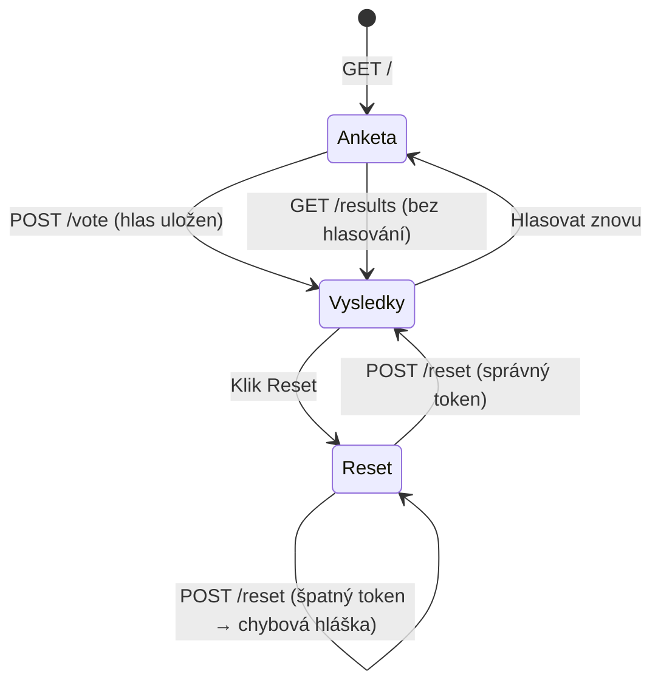
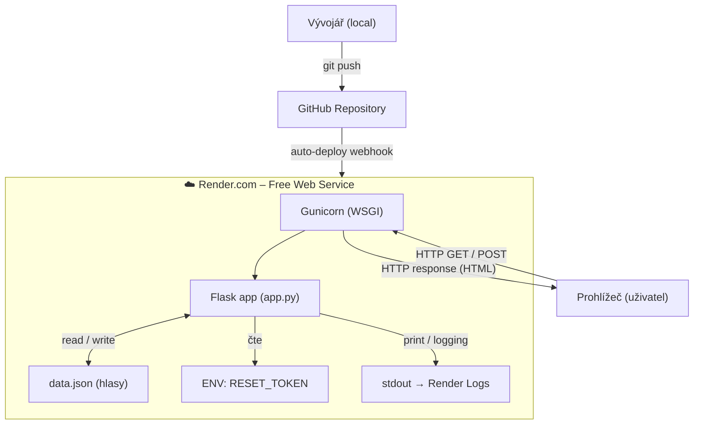
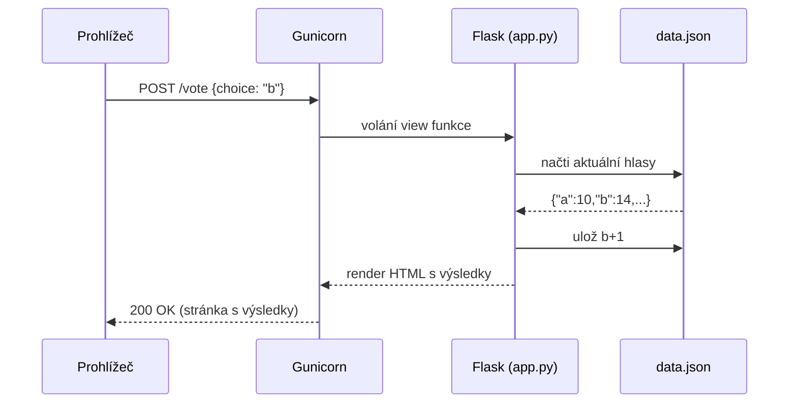

# Anketa – Záložkový průzkum

> Jednoduchá hlasovací webová aplikace | Python · Flask · Render.com

---

## Obsah

1. [Popis aplikace](#popis-aplikace)
2. [Wireframe](#wireframe)
3. [Deployment diagram](#deployment-diagram)
4. [Struktura souborů](#struktura-souborů)
5. [API endpointy](#api-endpointy)
6. [Konfigurace](#konfigurace)
7. [Lokální spuštění](#lokální-spuštění)
8. [Nasazení na Render.com](#nasazení-na-rendercom)

---

## Popis aplikace

Anketa o jedné otázce s persistentními výsledky a chráněným resetem.

**Otázka:** *Kolik otevřených záložek je ještě normální?*

| Volba | Odpověď |
|-------|---------|
| a | 1–5 (jsem organizovaný člověk) |
| b | 6–20 (standardní uživatel) |
| c | 21–50 (power user) |
| d | 51+ (záložky jsou způsob života) |

### Funkční požadavky

| ID | Funkce | Stav |
|----|--------|------|
| F1 | Hlasování – výběr jedné možnosti a odeslání | ⬜ |
| F2 | Zobrazení výsledků (i bez hlasování), perzistentní data sdílená mezi uživateli | ⬜ |
| F3 | Reset hlasů chráněný serverovým tokenem | ⬜ |

---

## Wireframe

Wireframe zachycuje tři stavy jedné stránky. Navigace mezi nimi probíhá bez přechodu na jinou URL.

```
┌─────────────────────────────────────────────────────────────┐
│           Anketa – Záložkový průzkum              [nav]  │
├─────────────────────────────────────────────────────────────┤
│                                                             │
│  Kolik otevřených záložek je ještě normální?                │
│                                                             │
│  ○  a)  1–5   (jsem organizovaný člověk)                   │
│  ○  b)  6–20  (standardní uživatel)                        │
│  ○  c)  21–50 (power user)                                 │
│  ○  d)  51+   (záložky jsou způsob života)                 │
│                                                             │
│  [ Hlasovat ]       [ Jen zobrazit výsledky → ]           │
│                                                             │
├─────────────────────────────────────────────────────────────┤
│  VÝSLEDKY                                    Celkem: 42    │
│                                                             │
│  a) ████████░░░░░░░░░░  10 hlasů  (24%)                   │
│  b) ████████████░░░░░░  15 hlasů  (36%)                   │
│  c) ██████░░░░░░░░░░░░   8 hlasů  (19%)                   │
│  d) █████████░░░░░░░░░   9 hlasů  (21%)                   │
│                                                             │
├─────────────────────────────────────────────────────────────┤
│  Reset hlasování                                         │
│  Token: [________________]  [ Resetovat ]                   │
│                                                             │
│  Nesprávný token.  /  Hlasování bylo resetováno.      │
└─────────────────────────────────────────────────────────────┘
```

### Stavový diagram UI



---

## Deployment diagram



### Tok HTTP požadavku



---

## Struktura souborů

```
anketa/
│
├── app.py                  # Flask aplikace – routes, logika
├── config.py               # Konfigurace (RESET_TOKEN, cesta k datům)
│
├── data/
│   └── votes.json          # Persistentní úložiště hlasů (auto-vytvořeno)
│
├── templates/
│   └── index.html          # Jinja2 šablona – UI ankety + výsledky
│
├── static/
│   └── style.css           # Volitelný vlastní CSS
│
├── logs/                   # Lokální logy (na Render.com stdout)
│   └── .gitkeep
│
├── requirements.txt        # Python závislosti (Flask, gunicorn)
├── Procfile                # Příkaz pro Render.com: web: gunicorn app:app
├── .env.example            # Vzor proměnných prostředí (bez skutečného tokenu!)
├── .gitignore              # data/, logs/, .env, __pycache__
└── README.md               # Tato dokumentace
```

### Zodpovědnosti jednotlivých souborů

| Soubor | Účel |
|--------|------|
| `app.py` | Všechny HTTP routes, čtení/zápis hlasů, validace tokenu |
| `config.py` | Načte `RESET_TOKEN` z env proměnné, fallback na default |
| `data/votes.json` | Sdílený stav – počet hlasů pro každou možnost |
| `templates/index.html` | Renderovaný HTML výstup (Jinja2), bar chart přes CSS |
| `Procfile` | Říká Render.com jak spustit aplikaci |
| `.env.example` | Dokumentuje potřebné proměnné, **neobsahuje skutečné hodnoty** |

---

## API endpointy

### Přehled

| Metoda | URL | Popis |
|--------|-----|-------|
| `GET` | `/` | Zobrazí anketu (formulář pro hlasování) |
| `GET` | `/results` | Zobrazí výsledky bez možnosti hlasovat |
| `POST` | `/vote` | Uloží hlas, přesměruje na výsledky |
| `POST` | `/reset` | Resetuje hlasy (vyžaduje token) |

---

### `GET /`

**Popis:** Hlavní stránka s anketou.

**Response:** `200 OK` – HTML stránka s formulářem

```
Zobrazí:
  - Otázku
  - Radio buttony (a, b, c, d)
  - Tlačítko "Hlasovat"
  - Odkaz "Jen zobrazit výsledky"
```

---

### `GET /results`

**Popis:** Zobrazí aktuální výsledky bez formuláře pro hlasování.

**Response:** `200 OK` – HTML stránka s výsledky

```
Zobrazí:
  - Počty hlasů pro každou možnost
  - Procentuální podíl
  - Celkový počet hlasů
  - Odkaz zpět na anketu
  - Sekci pro reset
```

---

### `POST /vote`

**Popis:** Uloží hlas uživatele.

**Request body** (form data):
```
choice = "a" | "b" | "c" | "d"
```

**Chování:**
- Pokud `choice` není platná hodnota → `400 Bad Request`  
- Pokud platná → hlas se přičte do `votes.json`, redirect na `/results`

**Response:**
```
302 Redirect → /results     (úspěch)
400 Bad Request             (neplatná volba)
```

---

### `POST /reset`

**Popis:** Resetuje všechny hlasy na 0. Vyžaduje správný token.

**Request body** (form data):
```
token = "tajny_reset_token"
```

**Chování:**
- Token se **porovnává se serverovou hodnotou** (`RESET_TOKEN` z env)
- Správný token → všechny počty nastaveny na 0, redirect na `/results` se zprávou
- Špatný token → vrátí výsledky se chybovou hláškou, hlasy **nejsou změněny**

**Response:**
```
302 Redirect → /results?reset=ok       (správný token)
302 Redirect → /results?reset=denied   (špatný token)
```

---

## Konfigurace

Konfigurace probíhá přes **proměnné prostředí** (environment variables).

### `.env.example`

```dotenv
# Zkopíruj do .env a nastav vlastní hodnoty
RESET_TOKEN=muj_tajny_token_zde
DATA_FILE=data/votes.json
```

### Proměnné

| Proměnná | Výchozí hodnota | Popis |
|----------|----------------|-------|
| `RESET_TOKEN` | `"zmenit_pred_deploymentem"` | Token pro reset hlasů |
| `DATA_FILE` | `"data/votes.json"` | Cesta k souboru s hlasy |

> **Upozornění:** Soubor `.env` přidej do `.gitignore`. Nikdy ho nenahrávej na GitHub!  
> Na Render.com se token nastavuje v sekci **Environment → Add Environment Variable**.

---

## Lokální spuštění

```bash
# 1. Klonuj repozitář
git clone https://github.com/<user>/anketa.git
cd anketa

# 2. Vytvoř virtuální prostředí a instaluj závislosti
python3 -m venv venv
source venv/bin/activate          # Windows: venv\Scripts\activate
pip install -r requirements.txt

# 3. Nastav proměnné prostředí
cp .env.example .env
# Edituj .env a nastav RESET_TOKEN

# 4. Spusť aplikaci
flask run                         # http://localhost:5000
```

---

## Nasazení na Render.com

```
1. Nahraj kód na GitHub (veřejné nebo privátní repo)
2. Přihlás se na https://render.com
3. New → Web Service → připoj GitHub repo
4. Nastavení:
     Build Command:  pip install -r requirements.txt
     Start Command:  gunicorn app:app
     Environment:    Python 3
5. Environment Variables → Add:
     RESET_TOKEN = <tvůj tajný token>
6. Deploy → aplikace běží na https://anketa-xxx.onrender.com
```

> **Poznámka k datům na Render.com free tier:**  
> Free instance se po nečinnosti uspí (~15 min). Disk je ephemeral – soubor `votes.json` se při restartu instance smaže.  
> Pro plnou perzistenci použij **Render Persistent Disk** (placená volba) nebo ulož hlasy do **SQLite / externího Redis**.  
> Pro účely školní úlohy postačí in-memory slovník nebo lokální soubor.

